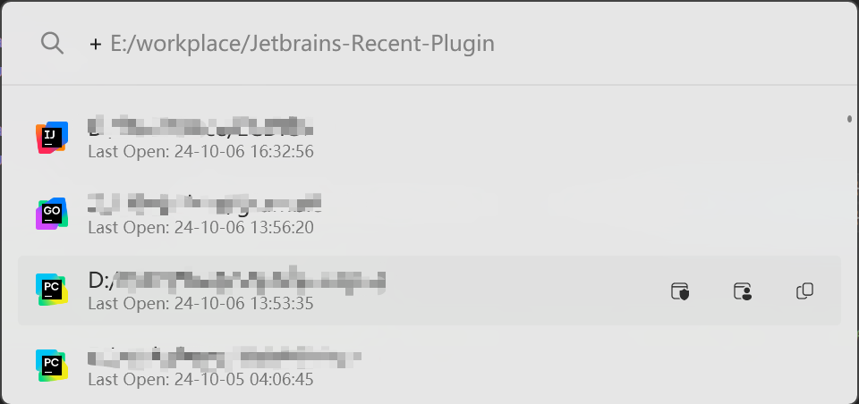
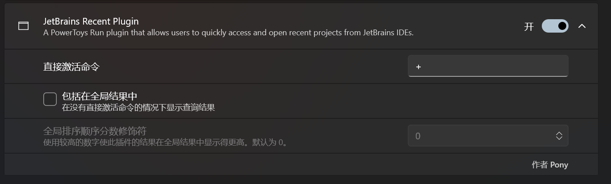

# PowerToys Run: JetBrains recent workspace plugin

Simple [PowerToys Run](https://learn.microsoft.com/windows/powertoys/run) experimental plugin for search JetBrains recent workspace.

## Installation

- Download the [latest release](https://github.com/pony-huang/JetBrains-Recent-Plugin/releases/) by selecting the architecture that matches your machine: `x64` (more common) or `ARM64`
- Close PowerToys
- Extract the archive to `%LOCALAPPDATA%\Microsoft\PowerToys\PowerToys Run\Plugins`
- Open PowerToys

## Screenshots

